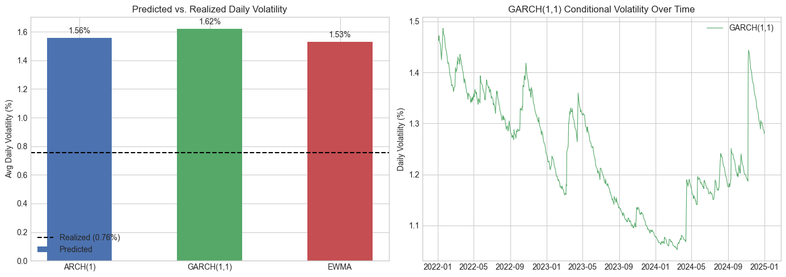

# Volatility Forecasting: ARCH vs. GARCH vs. EWMA

Fitted three volatility models on 3 years of JPM daily returns and evaluated their 5-day-ahead forecasts against realized volatility in early January 2025.

## Why This Project

Volatility forecasting is central to options pricing, portfolio risk management, and regulatory capital calculations (Basel). I wanted to go beyond just fitting a GARCH model and actually benchmark it against simpler alternatives on real data to see how much the added complexity buys you.

## Models

| Model | Key Idea | Parameters |
|-------|----------|------------|
| **ARCH(1)** | Today's variance = f(yesterday's squared return) | ω, α₁ |
| **GARCH(1,1)** | Adds variance persistence: today's variance = f(yesterday's return + yesterday's variance) | ω, α₁, β₁ |
| **EWMA (λ=0.94)** | Special case of GARCH with no intercept, exponentially decaying weights. RiskMetrics standard | λ |

## Results

All three models overpredicted for this particular 5-day window. The first week of January 2025 was unusually calm (realized daily vol ~0.76%) relative to the 3-year training sample (~1.57%).

| Model | Predicted Daily Vol | Realized Daily Vol | Error |
|-------|--------------------|--------------------|-------|
| ARCH(1) | 1.56% | 0.76% | +105.7% |
| GARCH(1,1) | 1.62% | 0.76% | +114.2% |
| EWMA (λ=0.94) | 1.53% | 0.76% | +102.2% |

The large errors are mostly driven by the short evaluation window (5 trading days). With such a small sample the realized vol benchmark itself is noisy. A rolling-window backtest across many forecast periods would give more reliable error estimates.

GARCH produced the most stable day-to-day forecasts across the 5-day horizon, which is expected given its persistence term (β ≈ 0.97). ARCH forecasts converged quickly to the unconditional variance, and EWMA produced a flat forecast by construction.

### Predicted vs. Realized



## Data

- **Ticker:** JPM (JPMorgan Chase)
- **Training period:** 2022-01-01 to 2025-01-01 (752 observations)
- **Forecast horizon:** 5 trading days (Jan 2–8, 2025)
- **Source:** Yahoo Finance via `yfinance`

## How to Run

```bash
pip install -r requirements.txt
jupyter notebook volatility_forecasting_arch_garch_ewma.ipynb
```

## Possible Extensions

- Rolling-window backtest to get more robust error metrics
- Student-t distribution instead of Normal to handle fat tails
- EGARCH or GJR-GARCH to capture the leverage effect (negative returns → larger vol spikes)
- Compare across multiple tickers / asset classes

## Built With

- Python 3.10+
- [arch](https://arch.readthedocs.io/) — ARCH/GARCH modeling
- [yfinance](https://github.com/ranaroussi/yfinance) — market data
- NumPy, pandas, matplotlib
